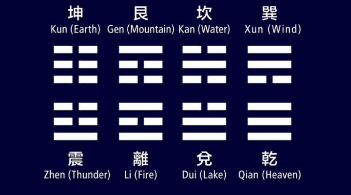

# I-Ching
The I Ching, (also known as the Yi Jing) is an ancient Chinese oracle. It is based on a 3000 year old manuscript of Chinese wisdom called "The Book of Changes".

Throughout history, the Book of Changes has been used principally as a divinatory text. It provides deeply insightful spiritual guidance and accurately answers questions about life, love, business, health, self realization and personal issues. The I Ching, or the ancient Chinese Book of Changes is the oldest divination manual still in use today.

The core of the I Ching are its 64 hexagrams, each composed of six lines. Each horizontal line has either a broken and unbroken state, allowing for a total of 64 possible combinations.

These hexagrams which reflect both ancient Confucianist and Taoist philosophy each carry a primary divinatory meaning which serves as the "answer" to a querent's question. Many students of Western divination systems from tarot cards to astrology enjoy the I Ching's unique Oriental philosophical perspective.

In addition to the primary meaning of each hexagram, each I Ching reading also provides more subtle secondary reading pertaining to "changing lines". (Keep reading and we'll discuss the changing lines in more detail below).
