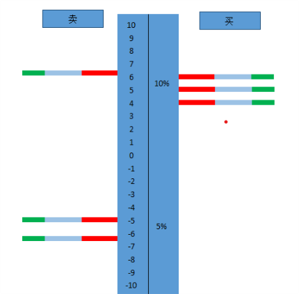
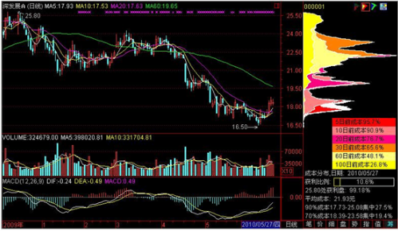
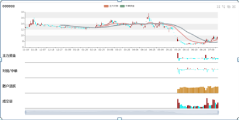

# StocksFlux

Using Machine Learning  to Analyse Stocks.

## Prerequisites
- Python 3+
- numpy
- pandas
- matplotlib
- TensorFlow 2.0

## 百度网盘API接口
- auth: https://pan.baidu.com/share/verify?surl={} POST pwd=
- list file: https://pan.baidu.com/share/list?shorturl={}&sekey={}&dir={}&page=1&num=10
- download
  1. 通过列表类接口获取到文件ID(fsid)
  2. 使用fsid调用https://pan.baidu.com/rest/2.0/xpan/multimedia?method=filemetas获取文件下载地址dlink
  3. 使用dlink下载文件
## Todo
- 建立一种数据获取方法
> 从雅虎财经、tushare等获取指定日期指定股票代码从指定日期到一年前的交易数据，用于画K线。因为我们买的数据会有缺失，所以必须从第三方获取。
假如可以获取120min/60min/30min的K线，也要把这部分数据保留着

- 建立一个读取本地数据的方法（要长远到该方法以后可以稍微修改就可以读取服务器的数据）

- 本地数据的计算
  - 设定阈值：设定超大单、大单、中单和小单的阈值，可以变更，这个阈值可以为后面训练算法做为调节参数；设定时间阈值，时间阈值指的是在某个时间范围内，发生的交易金额；设定阈值，用来监视散户（如果10万金额的交易）占总成交额的比率；设定阈值，用于监视大单直接交易，如2000万的资金直接卖给另外一个买方ID
  - 超大、大、中小单的区分：根据SaleOrderID或者BuyOrderID的下单量X价格得出的金额与设定阈值进行比较，然后归类并统计
  - 需要注意的是，在上述大小单归类的时候，在某个时间范围比如9:30:25前30秒或后30秒，如果存在较为集中的中单，就是在这30秒内连续有很多中单在交易，那么这部分中单要统计到大单里面去（买卖均是）（这是我想的到，但是编写不来的）
  - 统计散户成交占总成交额的比率
  - 统计主力对倒：大单直接交易的金额
  - 筹码的统计：
    - 筹码指在当日在某一个价位上发生了多少成交（初步希望做两个图：图一买卖分开；图二统计成交占比（%））
      * 
    - 累积筹码统计：累积筹码指价格与交易量随时间关系的（同时大单、中单要用不同颜色标记）不同时间内的也是一定颜色区分，如通达信这个图：
      * 

- 本地计算后数据的存储
> 本地数据计算后，希望以一个合适的方式存储，体量小，便于以后从服务器直接获取，或者进行选股操作和量化交易的回测；不建议存到原始数据中，怕以后再次分析，对原始数据造成破坏；

- 相关指标（用ta-lib扩展算）
  - MACD
  - 3、13、21、30、60移动平均的计算
  - 牛熊线计算，需要将上述移动平均的基础上才可以算出（加权平均）：bull_bear_line_tmp = sma_13*0.72 + sma_3*0.083 + sma_60*0.05 + sma_21*0.051 +sma_30*0.1

- 界面与绘图
  - 界面参考：同花顺软件
    * 

--- 
注意事项：
> ￥采用伸缩滑块，交互体验更好，也更适合平板手机等设备
￥我的图展示的数据有点多，建议展示K线、主力资金和MACD三个图，其他图做成折叠的形式插入到主力资金和MACD中，可以点击切换
￥在图K线区左右侧分布展示指针指示日期内筹码、和累积筹码
￥牛熊线和30日均线叠加到K线上，美化处理，当收盘价在牛熊线之上，牛熊线和30日均线为红色和粉红色，当收盘价在牛熊线下，用绿色和黑色表示牛熊线和30日均线
